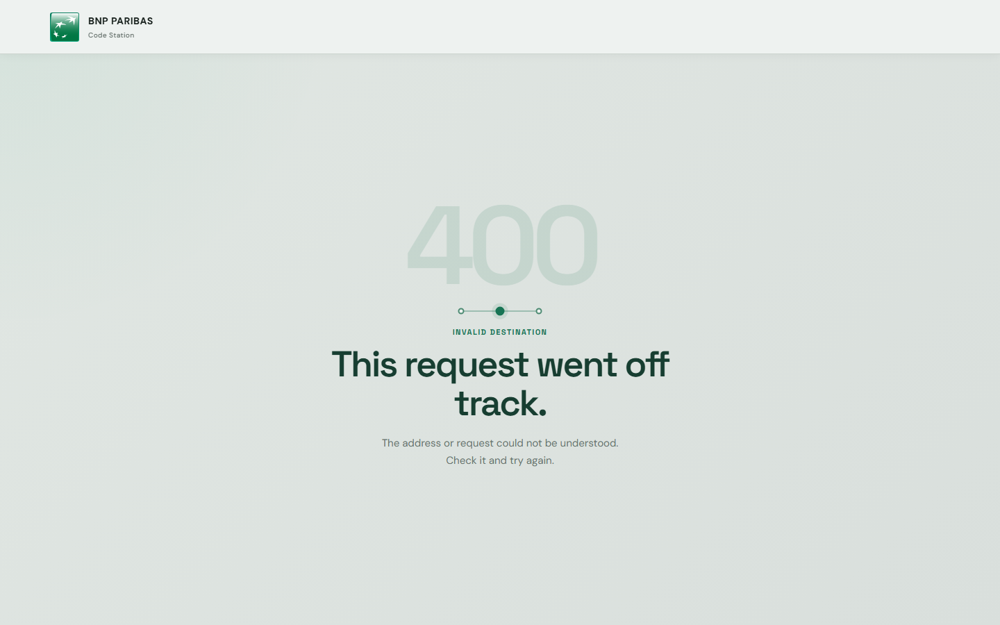
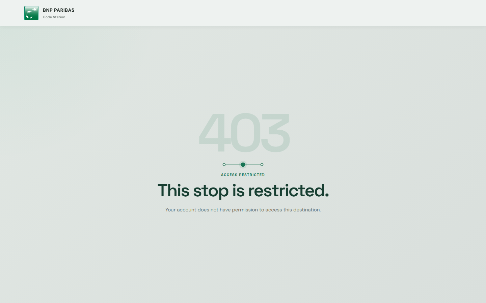
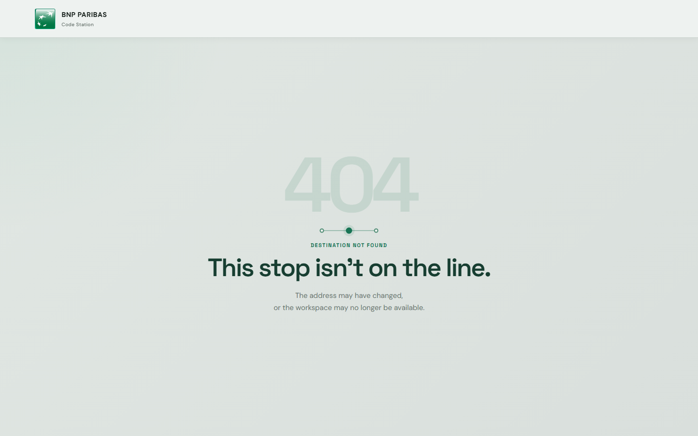
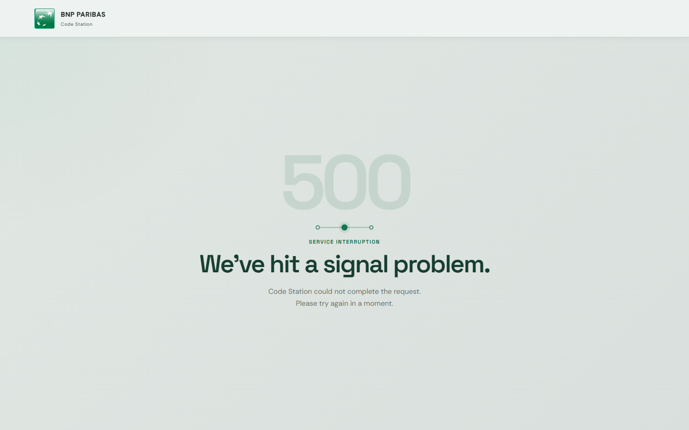

# Code Station

Code Station is a JupyterHub portal for launching isolated VS Code workspaces in Kubernetes from multiple images.

## Included features

- A custom responsive authentication page.
- Fully local UI assets, including the DM Sans and Space Grotesk fonts (no browser-time CDN dependency).
- A profile selection page displayed before each launch.
- Standard OIDC authentication compatible with Keycloak, Authentik, Entra ID, and other providers.
- Direct LDAP authentication over LDAPS.
- Five workspace images: Python, Data Science, Node.js, Java, and CUDA.
- Persistent per-user storage.
- CPU and memory limits per profile, with optional NVIDIA GPU support.
- A Zero to JupyterHub Helm configuration.

## Quick start

### 1. Build and publish the images

```powershell
$Registry = "registry.example.com/jupyter"
$Version = "0.1.0"

docker build -t "$Registry/hub:$Version" -f images/hub/Dockerfile .
docker build -t "$Registry/vscode-python:$Version" --build-arg PROFILE=python -f images/workspace/Dockerfile .
docker build -t "$Registry/vscode-datascience:$Version" --build-arg PROFILE=datascience -f images/workspace/Dockerfile .
docker build -t "$Registry/vscode-node:$Version" --build-arg PROFILE=node -f images/workspace/Dockerfile .
docker build -t "$Registry/vscode-java:$Version" --build-arg PROFILE=java -f images/workspace/Dockerfile .
docker build -t "$Registry/vscode-cuda:$Version" --build-arg PROFILE=cuda -f images/workspace/Dockerfile .

docker push "$Registry/hub:$Version"
docker push "$Registry/vscode-python:$Version"
docker push "$Registry/vscode-datascience:$Version"
docker push "$Registry/vscode-node:$Version"
docker push "$Registry/vscode-java:$Version"
docker push "$Registry/vscode-cuda:$Version"
```

### 2. Configure OIDC and LDAP

Create an OIDC client with this redirect URL:

```text
https://jupyter.example.com/hub/oauth_callback
```

Create the Kubernetes OIDC secret:

```powershell
kubectl create namespace jupyterhub
kubectl -n jupyterhub create secret generic jupyterhub-oidc `
  --from-literal=client-id='jupyterhub' `
  --from-literal=client-secret='change-me' `
  --from-literal=authorize-url='https://id.example.com/application/o/authorize/' `
  --from-literal=token-url='https://id.example.com/application/o/token/' `
  --from-literal=userdata-url='https://id.example.com/application/o/userinfo/' `
  --from-literal=logout-url='https://id.example.com/application/o/end-session/'
```

Create the LDAP secret as well. Always use LDAPS in production:

```powershell
kubectl -n jupyterhub create secret generic jupyterhub-ldap `
  --from-literal=server-address='ldap.example.com' `
  --from-literal=bind-dn-template='uid={username},ou=people,dc=example,dc=com'
```

The OIDC `preferred_username` value must match the corresponding LDAP username. This prevents one person from receiving two separate persistent workspaces depending on the authentication method used.

### 3. Deploy

Replace the image names and domain in [deploy/values.yaml](deploy/values.yaml), then run:

```powershell
helm repo add jupyterhub https://hub.jupyter.org/helm-chart/
helm repo update
helm upgrade --install vscode-hub jupyterhub/jupyterhub `
  --namespace jupyterhub `
  --create-namespace `
  --values deploy/values.yaml
```

## Add a profile

Add an entry to `singleuser.profileList` in `deploy/values.yaml`. The `display_name` and description are displayed in the profile selector. The image must start Jupyter Server and expose VS Code through `jupyter-server-proxy`.

## Local interface development

Open [preview/login.html](preview/login.html) to preview the authentication page and [preview/index.html](preview/index.html) to preview the five profiles. These static pages reproduce the interface without requiring a Kubernetes cluster.

To test the real JupyterHub templates and KubeSpawner-style radio markup:

```powershell
docker compose -f docker-compose.profile-test.yml up --build
```

Open `http://localhost:8000/hub/login`, sign in with any username and the password `test`, then open `http://localhost:8000/hub/spawn`. Launching a profile keeps the real spawn-progress page visible for 30 seconds before failing intentionally. Error previews are available at `/hub/theme-preview/400`, `/hub/theme-preview/403`, `/hub/missing`, and `/hub/theme-preview/500`. This compose file is a UI test harness only; it does not start a workspace container or connect to Kubernetes.

## Error theme previews

| 400 | 403 |
| --- | --- |
|  |  |

| 404 | 500 |
| --- | --- |
|  |  |

## Security

- No VS Code password is exposed: access is controlled by the JupyterHub session.
- Containers run as a non-root user.
- The Jupyter token remains enabled and is injected into the pod by JupyterHub.
- Enable TLS on the Ingress in production.
- Restrict access with `allowed_groups` when the identity provider exposes group membership.
- Use LDAPS with valid CA verification for direct LDAP authentication.
